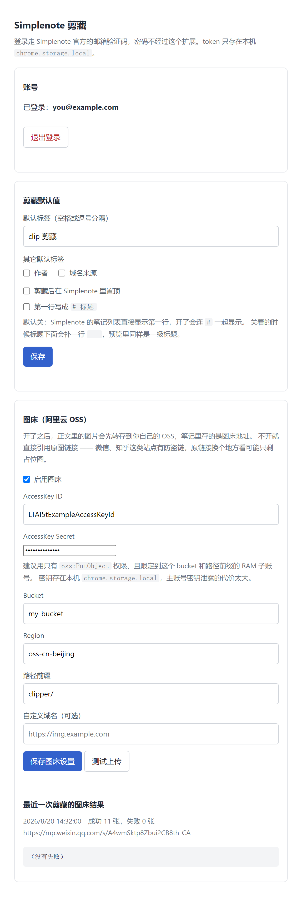
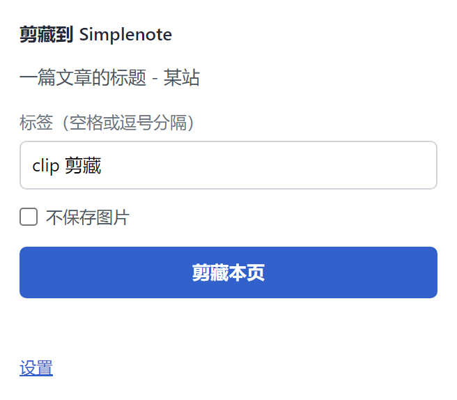

# Simplenote 剪藏

Chrome / Edge MV3 扩展：提取当前网页正文，转成 Markdown，直接写进 Simplenote。

不依赖任何中转服务，也不需要自建后端。扩展直接调用 Simplenote 官方的 Simperium API，
加载后登录即可用。

## 安装

1. 打开 `chrome://extensions/`（Edge 是 `edge://extensions/`）
2. 打开「开发者模式」
3. 点「加载已解压的扩展程序」，选这个目录

设置页长这样（图里都是示例值）：



## 登录

点扩展图标 → 「设置」，填 Simplenote 邮箱 → 发送验证码 → 填邮件里的验证码 → 登录。

走的是 Simplenote 官方的邮箱魔法链接流程，**密码不经过这个扩展**。拿到的 token 只存在本机
`chrome.storage.local`，不上传、不写日志、不进 git。「退出登录」会把它清掉。

## 用法

- 点扩展图标 → 改标签（可选）→「剪藏本页」
- 不想要正文里的图就勾上「不保存图片」，见[下面这节](#为什么有不保存图片)
- 剪出来挤成一坨、满屏 `#` 和 `**` 的，勾上「移除 Markdown 格式」重剪一次，
  见[下面这节](#为什么有移除-markdown-格式)
- 推特的推文页上还多一个「同时剪藏评论」，默认勾着（推特很多内容是一串，只剪第一条不完整），
  不想要底下的评论就取消勾选
- 或在页面上右键 →「剪藏到 Simplenote」，用设置里的默认标签（走默认，图照留）
- 图床配置好后，右键扩展图标 →「上传剪贴板图片并复制 Markdown 链接」，会把剪贴板里的图片
  上传到 OSS，并把 `` 写回剪贴板



写进 Simplenote 的笔记长这样：

```
文章标题
---

url: https://example.com/article  
author: 某某  
published: 2026-08-01  
created: 2026-08-20  

## 小节标题

正文段落，**行内标记**、[链接](https://example.com)、列表、代码块、表格都会保留。
```

三个看着别扭但都是有原因的地方：

- **第一行是纯标题，`---` 在第二行。** Simplenote 的笔记列表直接显示第一行，顶格写
  `---` 会让每条笔记都叫「---」。放在标题下面正好是 markdown 的 setext 一级标题写法：
  预览里是 H1，列表里仍然是干净的标题。
- **属性区没有收尾的 `---`**，因为不需要，留着预览里会多一条横线。
- **每行属性末尾有两个空格。** 这是 markdown 的硬换行写法。Simplenote 的预览会把连续几行
  并成一段，桌面端一个空格还能断开，移动端必须两个。

设置里可以把第一行改成 `# 标题`（默认关闭），开了就不再补 `---`，免得一个标题套两种写法。

正文开头如果有和标题一模一样的一行（大部分文章页的 `<h1>` 就是标题，勾了「移除 Markdown
格式」之后它没有井号），会被去掉，不然笔记里会连着出现两行标题。只在一字不差时去掉，
不一致的保留 —— 那是文章自己的小节标题。

笔记默认打上 `markdown` 这个 systemTag，Simplenote 客户端里会按 Markdown 渲染。

### 为什么有「不保存图片」

**有些文章的插图是梗图、表情包、和内容无关的配图。我特别讨厌。** 这类图对以后重读这篇文章没有价值，
却会把笔记撑得很长，在 Simplenote 的笔记列表和正文里翻起来都碍事。以前只能剪完之后
进笔记一张张删，删的还是自己刚存进去的东西。

这个复选框把这件事挪到剪藏之前：勾上再点「剪藏本页」，正文里的图一张都不留，只留文字。
状态栏会告诉你去掉了几张。

三个设计选择，都是有意的：

- **默认不勾，而且不记住上次的选择。** 跳过图片是「这一篇不要图」的临时判断，不是长期
  偏好。记住上次的勾选，会让人在后面几篇里不知不觉丢掉真正想要的配图。想长期不要图，
  那是设置页的事，不是 popup 的事。
- **是删掉，不是留个链接。** 保留 `` 的占位跟没删一样碍事，Simplenote 的预览里
  还会留下一个个坏掉的图框。
- **勾上时图床整段不跑。** 不抓图、不上传、也不写图床报告。这次压根没走图床，用一份
  「0 张成功 0 张失败」去覆盖上次的结果，只会让人以为上次也没图。

图外面套着链接的情况（`[](href)`，很多站点的插图都能点开看原图）会连着链接
一起删干净，不会剩下 `[](href)` 这种指向不明的空链接。

### 为什么有「移除 Markdown 格式」

**有些文章剪出来全文挤成一行，满屏 `#`。这不是本插件的问题，是因为原始网页的 HTML
根本没分段。** 公众号编辑器最典型：整篇三千字正文塞在一个 `<h1>` 里，段落之间只靠
`<section>` 的 CSS 样式撑开。而 Markdown 的 `# 标题` 是单行语法，一换行标题就结束了，
转换器碰到 `<h1>` 只能把里面的内容压成一行，于是三千字全挤进同一行：

```
# Hi，我是Bruce 我其实做自由职业也有三年了，原本是做设计出身的，后面发现设计是年纪越大越难做…（下面 3000 字全在这一行里）
```

勾上「移除 Markdown 格式」再剪一次，同一篇变成：

```
Hi，我是Bruce

我其实做自由职业也有三年了，原本是做设计出身的…


本命盘
```

具体到每种元素：

| 元素 | 正常剪藏 | 勾了「移除 Markdown 格式」 |
|------|----------|---------------------------|
| 标题 | `## 小节标题` | `小节标题`，当普通段落，**内部的段落分行保住** |
| 粗体 / 斜体 / 删除线 | `**粗**` `*斜*` `~~删~~` | 纯文字 |
| 行内代码 | `` `npm test` `` | `npm test` |
| 代码块 | ` ```js ` 围栏 | 去掉围栏，代码本身的换行照留 |
| 链接 | `[文字](https://…)` | 只留 `文字`，网址不写 |
| 引用 | `> 引用` | 去掉 `>`，当普通段落 |
| 分隔线 | `---` | 去掉，只留段间空行 |
| 图注 | `*图注*` | `图注` |
| **图片** | `` | **照旧**，图床转存也照跑 |
| 列表 / 表格 | `- 项` / `\| 单元格 \|` | **照旧** |

几个刻意的取舍：

- **图片不动。** 这个开关治的是排版，不是「不要图」—— 不要图是隔壁那个复选框，两个可以
  一起勾。图片仍然是 `` 写法，所以配了图床的话照样会转存。
- **列表和表格不动。** 去掉 `- ` 和 `|`，一份清单就散成连不起来的几行、一张表就糊成一坨，
  比多几个符号糟得多。这两样是结构，不是装饰。
- **只作用于正文。** 笔记开头的标题行、`---`、`url:` / `author:` 那几行属性照旧 ——
  那是笔记本身的骨架（第一行要当笔记标题用，见上面那节），不是文章的排版。设置页的
  「第一行写成 `# 标题`」也仍然管用。
- **默认不勾，也不记住上次的选择。** 和「不保存图片」一样，这是「这一篇的排版是坏的」的
  临时判断。绝大多数站点的正常排版值得保留，记住勾选会让后面几篇白白丢掉小节标题和链接。
- **不是事后拿正则去洗 markdown**，而是转换时就不写这些标记。事后洗会把正文里本来就有的
  `*`、`#`、`_` 一起洗掉。也正因为是在转换阶段做的，才能顺手修掉「整篇塞在 `<h1>` 里」
  这种压行问题 —— 那才是这一坨的真正成因。

### 站点兼容

大部分文章页走通用启发式就能抓，不用配置。微信公众号、微博、小红书、X（推特）写了专用
规则（SPA 或者正文里一个 `<p>` 都没有，通用打分对付不了）。实测过哪些站点、各自怎么取、
还有什么缺口，见 **[docs/sites.md](docs/sites.md)**，加新站点的步骤也在那里。

推特剪的是你点开的那一条推：正文、配图、视频封面和引用推文（引用的那条排成
`**昵称 @handle** · [日期](原推链接)` 加正文），头像和「转推 / 收藏 / Views」
那一排数字不进笔记。标题存成 `沐阳 on X: 正文开头…`，笔记列表里一眼看得出是谁的哪条推。
主推底下的串和评论默认一起剪（popup 里可以取消），接在正文后面用 `---` 隔开、抬头
一句 `## Comments`，一条评论一段引用：`**昵称 @handle** · [日期](原推链接)` 加正文和配图，
回复某条评论的那条套进它的引用段里 —— 版式和 Obsidian 官方剪藏器对齐。

小红书要在登录态下才抓得到：干净 profile 打开笔记页会被风控挡成一张拦截页。扩展跑在你
自己的浏览器里没问题，用 `tools/probe.mjs` 调试则拿不到内容，得连已登录的浏览器。

### 标签

标签 = 你手填的（或设置里的默认值）。设置页的「其它默认标签」还有两个开关，勾上才会
额外打标签，默认都关：

| 开关 | 加什么 |
|------|--------|
| 作者 | 作者名，里面的空格换成连字符（`John Smith` → `John-Smith`），否则 Simplenote 会按空格把它拆成好几个标签 |
| 域名来源 | 来源站点，走下面那张映射表 |

站点标签走 `lib/domains.js` 里的映射表，子域自动继承（`zhuanlan.zhihu.com` → `知乎`），
没配的域名退回主机名本身，不硬造中文名。常用站点加映射直接改那张表：

| URL | 标签 |
|-----|------|
| `mp.weixin.qq.com/s/xxx` | `公众号` |
| `weibo.com/xxx` | `微博` |
| `zhuanlan.zhihu.com/p/1` | `知乎` |
| `blog.example.com/a` | `blog.example.com` |

作者在笔记属性区里始终是原样的名字，和标签那份不是同一个形态。站点不进属性区。

## 图床（可选）

不配的话，笔记里就是原图链接。微信、知乎这类站点有防盗链：带错 Referer 取图只会拿到
「未经允许不可引用」的占位图，换个客户端看就废了。配了图床，正文里的图片会先转存到
你自己的阿里云 OSS，笔记里存的是图床地址。

设置页填 AccessKey ID / Secret、Bucket、Region，可选路径前缀和自定义域名。

几个实现上的决定：

- **用 URL 签名，不用请求头签名。** 请求头方案要发 `Date` 头，而 `Date` 是 fetch 规范里的
  禁止头，浏览器会静默删掉，签名必然对不上。URL 签名把 `OSSAccessKeyId` / `Expires` /
  `Signature` 放 query，不碰任何禁止头。
- **对象名是内容哈希**（`<前缀>/<年-月>/<sha256 前 16 位>.<后缀>`）。同一张图重复剪藏不会
  传两份，也不会因为原站文件名撞车而互相覆盖。
- **单张失败就保留原链接**，不让整次剪藏失败。少一张图的笔记比没有笔记有用。
- **默认不发 Referer**，扩展 service worker 本来就不发，微信这类防盗链站点反而给原图。
  微博相反：sinaimg 认的是「浏览器 UA + 没有 Referer」这个组合，实测 curl 裸请求 200，
  换 Chrome UA 立刻 403，补上 `Referer: https://weibo.com/` 又回到 200。`Referer` 是 fetch
  的禁止头改不了，所以抓图期间临时装一条 `declarativeNetRequest` 会话规则把它补上，抓完撤掉。
  规则限定在 `tabIds: [-1]`（service worker 自己发的请求），不碰你正在看的页面。
  哪个站点要补什么 Referer 写在 `lib/site-rules.js` 的 `imageReferer` / `imageHosts` 里。
- 单张超过 10 MB 跳过；同时最多传 4 张。
- bucket 不需要配 CORS 规则：扩展拿到 host 权限后发请求不受 CORS 限制。

**权限**：抓任意站点的图需要跨域读取权限，这是个可选权限（`optional_host_permissions`），
只在设置页勾选「启用图床」时才向你申请。不用图床的话，装扩展不需要授权全站访问。
右键上传剪贴板图片首次使用时会另外申请剪贴板读写权限；不使用这个入口就不会申请。
改 Referer 用的是 `declarativeNetRequestWithHostAccess`，它只能作用在你已经授权的站点上，
装扩展时不会多出授权弹窗。

**密钥**：AccessKey 存在本机 `chrome.storage.local`。建议用只有 `oss:PutObject` 权限、
并且限定到这个 bucket 和路径前缀的 RAM 子账号，别用主账号密钥。

### 传不上去怎么查

设置页的**「测试上传」**按钮会传一张 1×1 PNG，按顺序验三件事：配置全不全、有没有拿到
跨域权限、OSS 收不收。OSS 的错误码原样带出来，并附上下一步该做什么：

| OSS 错误码 | 意思 |
|-----------|------|
| `InvalidAccessKeyId` | AccessKey ID 填错了，或者已被删除 |
| `SignatureDoesNotMatch` | Secret 不对，或者 bucket / region 和密钥不属于同一个账号 |
| `AccessDenied` | 密钥有效但没写权限，给 RAM 子账号加 `oss:PutObject`，确认授权路径覆盖了填的前缀 |
| `NoSuchBucket` | Bucket 不存在，或者 region 填错（bucket 和 region 必须对得上） |
| `RequestTimeTooSkewed` | 本机时钟和 OSS 差太多，校准系统时间 |

设置页底部还会显示**最近一次剪藏**的图床结果：成功几张、失败几张、每张的失败原因。
popup 关掉就没了，这份是落盘的。

## 接口

| 用途 | 端点 |
|------|------|
| 发验证码 | `POST https://app.simplenote.com/account/request-login` |
| 换 token | `POST https://app.simplenote.com/account/complete-login` → `sync_token` |
| 建笔记 | `POST https://api.simperium.com/1/chalk-bump-f49/note/i/<uuid>?ccid=<uuid>`，头 `X-Simperium-Token` |

端点和字段口径抄自 [Automattic/simplenote-mcp](https://github.com/Automattic/simplenote-mcp)
（`src/providers/auth.ts`、`src/providers/simperium-api.ts`）。

两个容易踩的点：

- **`request_source` 必须是 `macOS` 或 `iOS`**。服务端按这个字段给 token 划范围，填自定义值
  能拿到 token，但 Simperium 写入时会拒。
- **note payload 要补齐 `publishURL` / `shareURL` / `systemTags` / `tags`**。Simperium 的
  REST POST 是整体替换，缺的字段会被别的客户端当成空值同步覆盖。

## 目录

| 文件 | 职责 |
|------|------|
| `lib/extract.js` | 网页正文与元信息提取。需要真 DOM，只在页面上下文里跑 |
| `lib/html2md.js` | DOM → Markdown。只用五个 DOM 接口走树，纯逻辑，可 node 测 |
| `lib/note.js` | 纯函数：拼笔记正文、组 Simperium payload、标签规范化 |
| `lib/domains.js` | 域名 → 标签映射表 |
| `lib/site-rules.js` | 站点专用提取规则，见 [docs/sites.md](docs/sites.md) |
| `lib/images.js` | 正文里图片链接的收集与替换、后缀判定、内容哈希 |
| `lib/oss.js` | 阿里云 OSS 签名与上传 |
| `lib/simperium.js` | 登录与写入的 HTTP 客户端，错误统一包成 `SimperiumError` |
| `lib/throttle.js` | 请求节流闸门，挡住连点重复发请求 |
| `storage.js` | `chrome.storage.local` 封装。**故意不放 lib/**，那个目录是 web accessible 的 |
| `background.js` | service worker：注入抓取 → 拼正文 → POST。放这里是因为 popup 一关 fetch 就断 |
| `popup.*` / `options.*` | 剪藏面板 / 登录与默认值设置 |
| `tools/probe.mjs` | 调试用：对真实页面跑一遍提取，见下 |
| `tools/screenshot.mjs` | 重新生成 README 里的设置页 / popup 截图 |

`lib/extract.js`、`lib/html2md.js`、`lib/site-rules.js` 在 `manifest.json` 里声明为
`web_accessible_resources`，因为注入脚本要 `import()` 它们；`lib/simperium.js`、
`storage.js` 不外露。给注入侧拆新模块时记得一起加进去，漏了页面会直接 `ReferenceError`。

## 测试

纯逻辑用 node 原生 test runner，无第三方依赖。`html2md` 的测试用 `tests/fake-dom.mjs` 手搓
假节点，不引 jsdom。

```bash
node --test "tests/*.test.mjs"
```

需要 Node 18 以上（`node --test` 从 18 开始提供）。系统默认的 node 版本较低时，
用 nvm / fnm 这类工具切一个新版本再跑。

图标用 Simplenote 官方应用图标，源文件 `icons/source-256.png` 取自
[simplenote-electron](https://github.com/Automattic/simplenote-electron)
的 `resources/images/icon_256x256.png`。`render.py` 只做裁白边和缩放，不改设计
（源图四周有约 14px 留白，16px 工具栏图标不裁的话白色圆盘在浅色工具栏上几乎看不见）：

```bash
python icons/render.py
```

截图改了 UI 之后重拍（起一个本地服务 + headless Chrome，喂的是假数据，
不会读到本机真实配置）：

```bash
node tools/screenshot.mjs           # 设置页 → docs/options.png
node tools/screenshot.mjs --popup   # popup → docs/popup.png
```

这两个工具都要 Node 22+（全局 `fetch` 和 `WebSocket`）。

## 调试某个站点抓不到正文

`lib/extract.js` 要真 DOM 才能跑，node 里测不了；抓 HTTP 请求也没用，很多站点的正文是
JS 渲染出来的。`tools/probe.mjs` 起一个独立 profile 的 Chrome（不碰你正在用的那个），
把提取逻辑注进页面执行：

```bash
node tools/probe.mjs "<url>"          # 看提取结果：标题、选中的容器、正文开头
node tools/probe.mjs "<url>" --dump   # 看页面里文字量最大的容器，定位正文到底在哪
node tools/probe.mjs "<url>" --wx     # 用微信 UA，公众号链接需要
node tools/probe.mjs "<url>" --show   # 开真窗口，不用 headless
```

要登录才给内容的站点（小红书用干净 profile 只会拿到风控拦截页）连已经登录的浏览器：

```bash
# 那个浏览器要带 --remote-debugging-port 启动，而且已经打开了目标页
node tools/probe.mjs "<url>" --attach=9224
```

`--attach` 不开新浏览器、不读 cookie，只是连上去在已经打开的那个 tab 里跑一遍提取。

排查顺序：`--dump` 看正文在哪个容器 → 不带参数看提取选中了谁。两者对不上就是选容器的
问题（改 `PREFERRED` 或 `scoreNode`）；选对了但 `mdLen` 很小，就是被 `cleanClone` 的噪声
规则误删了（改 `ALWAYS_JUNK` / `WEAK_JUNK`）。

## 已知边界

- **正文提取是启发式的**。语义选择器猜不中就按「段落文字量 × (1 - 链接密度)」打分选容器，
  论坛、瀑布流、SPA 这类页面会漏。提取不到正文时笔记只留链接，不会写出空笔记。
  新站点抓不到正文按上面的「调试某个站点抓不到正文」走，实测结论记进
  [docs/sites.md](docs/sites.md)。
- **微博的配图抓不到**，只取了正文。原因和补法见 [docs/sites.md](docs/sites.md)。
- **噪声过滤按 class / id 命名猜**，会误伤。命名里带 `share`、`nav`、`footer` 这类词但
  文字量大且不是链接堆的容器会被保留 —— 公众号正文就挂在 `p.share_notice_inner` 上，
  一刀切会把正文删光。短正文顶着这类命名时（公众号贴图页的一两句文案）还是会被删，
  只能在站点规则里用 `keep` 点名豁免。反过来，正文容器如果被命名成 `related` /
  `comments` 就一定会丢。
- **不去重**。同一个 URL 剪两次会产生两条笔记。查重要走 Simperium 的 index 接口全表扫，
  代价和收益不匹配，先不做。
- **只存文本**。Simplenote 不支持附件，图片以 Markdown 链接形式保留。想让图片长期可用
  就配图床，否则原站换域名或加防盗链之后笔记里的图就废了。
- **图床只支持阿里云 OSS**。腾讯 COS、七牛这些签名方式不同，没做。
- **不做划词剪藏**。当前只有整页正文一条路径。
- **受限页面剪不了**：`chrome://`、扩展商店、PDF 阅读器不允许注入脚本，会提示换页面。
- **发验证码和登录做了 3 秒节流**。只在请求进行中禁用按钮挡不住连点：请求一返回按钮
  立刻又能按，几下就撞上 Simplenote 的 429。节流从上一次请求**结束**算起。

## 许可

[MIT](LICENSE)。

图标是 Simplenote 官方应用图标，取自 [simplenote-electron](https://github.com/Automattic/simplenote-electron)，
版权归 Automattic 所有，不在本仓库的 MIT 许可范围内。这个扩展是第三方客户端，和
Automattic 没有关系。
